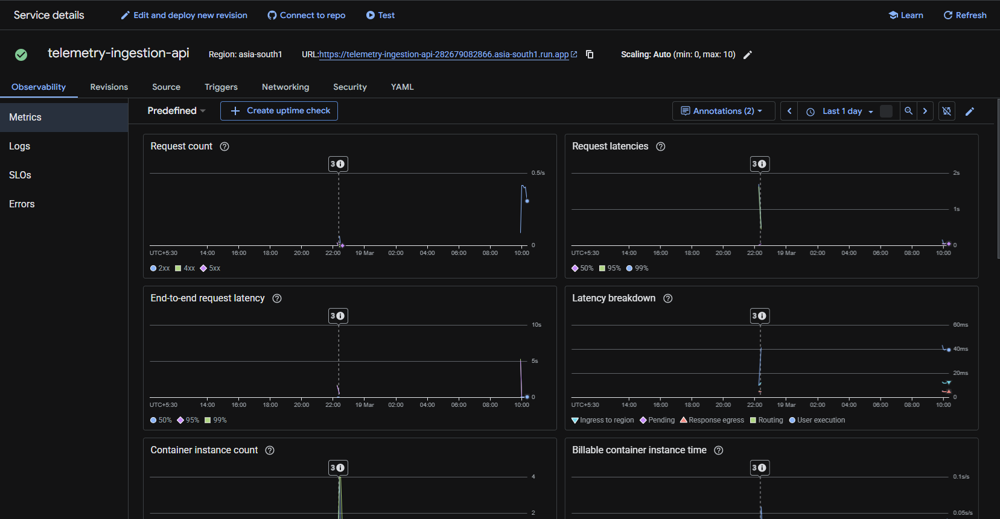
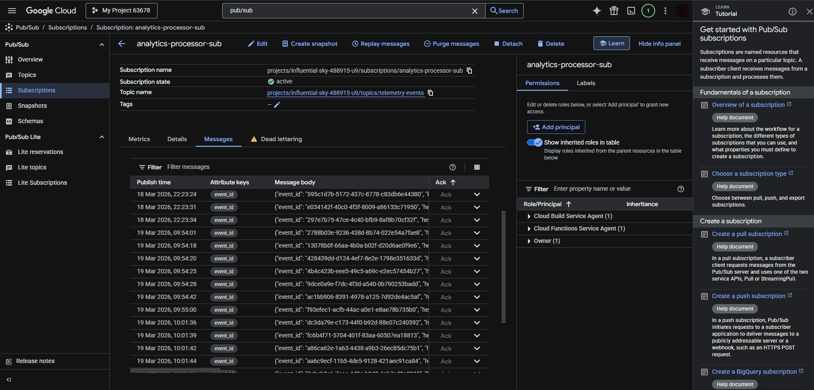
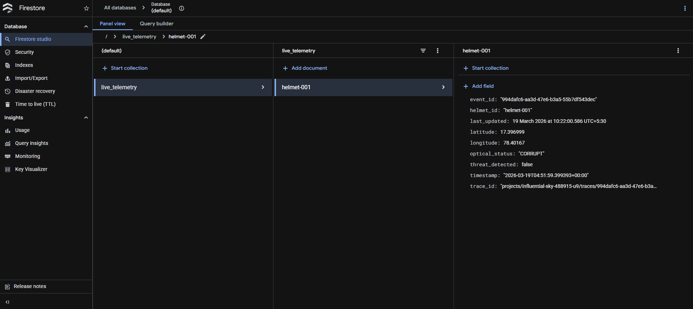
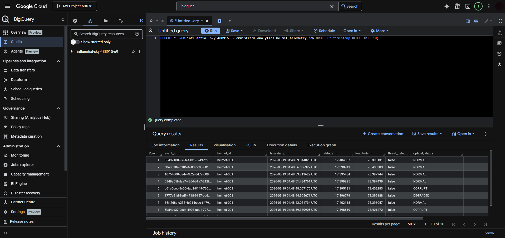
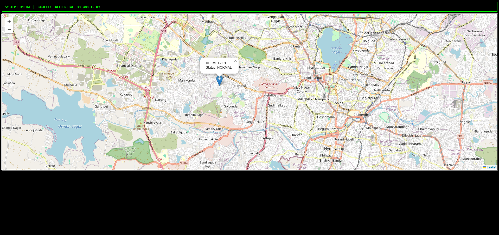

# 🛰️ GCP-OmniStream: Real-Time Tactical Telemetry Pipeline

[](https://cloud.google.com/)
[](https://www.terraform.io/)
[](https://fastapi.tiangolo.com/)
[](https://www.python.org/)

**GCP-OmniStream** is an industrial-grade, event-driven data pipeline engineered for the high-frequency ingestion and real-time visualization of telemetry from **Edge-AI Integrated Tactical Helmets**. Built with a focus on **FAANG-level resilience** and **FinOps optimization**, the system leverages a scale-to-zero serverless architecture to maintain sub-second latency while staying within a strict monthly budget.

---

## 🏗️ Architecture & Data Flow

The system follows a decoupled, asynchronous pattern to ensure maximum throughput and fault tolerance. Each component is independently scalable and isolated.

### 1. Edge Ingestion Layer

**Technical Proof:** This FastAPI service, deployed on **Google Cloud Run**, serves as the entry point for tactical hardware. It implements Pydantic-based payload validation and generates unique `trace_id` attributes, ensuring that only schema-compliant data enters the pipeline while maintaining distributed tracing capabilities.

### 2. Message Brokering (The Neural Core)

**Technical Proof:** **Google Cloud Pub/Sub** acts as the high-availability message bus, decoupling the ingestion API from downstream processing. It is configured with a **Dead-Letter Queue (DLQ)** to capture malformed or unprocessable packets, preventing silent data loss and enabling post-mortem analysis of edge-sensor failures.

### 3. Real-Time State Management

**Technical Proof:** The **Analytics Processor (Cloud Function)** performs a dual-write operation, synchronously updating **Google Firestore** with the latest device coordinates. This provides a sub-second "Hot Path" for the dashboard, ensuring the tactical map reflects the absolute current state of all active units.

### 4. Historical Data Warehousing

**Technical Proof:** Simultaneously, data is archived into **Google BigQuery** for long-term analytical processing. The table is **partitioned by day**, enabling high-performance SQL queries over millions of historical events for mission after-action reviews without incurring massive scan costs.

### 5. Tactical Command & Control UI

**Technical Proof:** The frontend dashboard utilizes **Leaflet.js** and the **Firebase SDK** to create a reactive web interface. It establishes a persistent listener on the Firestore collection, providing real-time marker updates on a map interface as telemetry flows through the pipeline—zero refresh required.

---

## �️ Technical Deep Dive

### **Resilience & Scaling**
- **Scale-to-Zero**: Utilizing Cloud Run (v2) and Cloud Functions allows the entire infrastructure to scale down to zero instances during periods of inactivity, effectively eliminating idle compute costs.
- **Idempotency**: The pipeline uses `event_id` keys to ensure that duplicate messages (a common occurrence in edge networking) do not result in redundant database writes.
- **Structured Logging**: Integrated with **Google Cloud Logging**, the system emits JSON-formatted logs with embedded severity levels and metadata for rapid debugging via Log Explorer.

### **FinOps Strategy**
- **Budget Capping**: Terraform-enforced `max_instance_count` limits on Cloud Run prevent unexpected billing spikes during DDoS or sensor malfunction.
- **Efficient Storage**: BigQuery is configured with `ignore_unknown_values=True`, allowing the schema to evolve without breaking the ingestion pipeline, while Firestore manages state TTLs to control storage costs.

---

## 📁 Project Structure

```bash
├── infrastructure/          # Terraform (IaC) for Pub/Sub, BQ, Firestore, IAM
├── services/
│   ├── analytics-processor/ # Cloud Function (Python) - Dual-write logic
│   └── telemetry-ingestion-api/ # Cloud Run (FastAPI) - Edge Entry Point
├── edge-simulation/         # Locust & Python scripts for load testing
└── dashboard.html           # Real-time Leaflet.js map with Firebase SDK
```

---

## � Quick Start

1. **Deploy Infrastructure**:
   ```powershell
   cd infrastructure
   terraform apply -var-file="terraform.tfvars"
   ```
2. **Launch Simulator**:
   ```powershell
   python edge-simulation/single_device_test.py --api-url="https://your-api-url.a.run.app/ingest"
   ```
3. **View Map**: Open `dashboard.html` in any modern browser to watch the live tactical feed.

---

**Author:** [Your Name/Portfolio]  
**Focus:** Cloud Architecture, Event-Driven Systems, SRE Principles
