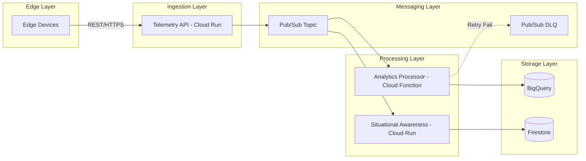

# 🛰️ GCP-OmniStream

[](https://opensource.org/licenses/MIT)
[](https://cloud.google.com/)
[](https://www.python.org/)
[](https://nodejs.org/)

**GCP-OmniStream** is a high-throughput, serverless, and event-driven data pipeline designed for real-time edge telemetry ingestion and analytics on Google Cloud Platform. While originally built for **Tactical Helmet AI Telemetry**, its extensible architecture makes it suitable for any high-frequency IoT use case.

---

## 📖 Table of Contents

- [Features](#-features)
- [Architecture](#-architecture)
- [Tech Stack](#-tech-stack)
- [Project Structure](#-project-structure)
- [Quick Start](#-quick-start)
  - [Prerequisites](#prerequisites)
  - [Infrastructure Deployment](#infrastructure-deployment)
  - [Services Deployment](#services-deployment)
- [Testing](#-testing)
- [API Endpoints](#-api-endpoints)
- [Data Payload Schema](#-data-payload-schema)
- [FinOps & Cost Optimization](#-finops--cost-optimization)

---

## ✨ Features

- **🚀 Serverless Scaling**: Uses Cloud Run and Cloud Functions to scale-to-zero, minimizing costs when idle.
- **⚡ Real-time Processing**: Sub-second latency from ingestion to analytics using Pub/Sub and BigQuery.
- **🛡️ Robust Error Handling**: Integrated Dead-Letter Queues (DLQ) for failed telemetry processing.
- **📊 Real-time Dashboard Support**: WebSocket server for live telemetry streaming to situational awareness dashboards.
- **📈 Advanced Analytics**: Partitioned BigQuery tables for efficient historical data analysis.
- **🧪 Integrated Simulation**: Built-in edge device simulators and locust-based load testing tools.

---

## 🏗️ Architecture

The system follows a decoupled, event-driven pattern for maximum reliability and scalability.



---

## 🛠️ Tech Stack

- **Infrastructure**: [Terraform](https://www.terraform.io/) (IaC)
- **API Framework**: [FastAPI](https://fastapi.tiangolo.com/) (Python 3.11)
- **Streaming**: [Google Cloud Pub/Sub](https://cloud.google.com/pubsub)
- **Real-time Server**: [Node.js](https://nodejs.org/) with WebSockets
- **Data Warehouse**: [Google BigQuery](https://cloud.google.com/bigquery)
- **NoSQL Database**: [Google Firestore](https://cloud.google.com/firestore)
- **CI/CD**: [GitHub Actions](https://github.com/features/actions)

---

## 📁 Project Structure

```bash
├── .github/workflows/       # CI/CD pipelines (Tests & Deployment)
├── docs/                    # Architecture details and schemas
├── edge-simulation/         # Python tools to simulate edge devices
├── infrastructure/          # Terraform configurations (GCP Resources)
└── services/
    ├── analytics-processor/ # Cloud Function (Python) - Pub/Sub to BigQuery
    ├── situational-awareness-stream/ # WebSocket Server (Node.js)
    └── telemetry-ingestion-api/     # FastAPI (Python) - Edge Ingestion
```

---

## 🚀 Quick Start

### Prerequisites

- [Google Cloud Account](https://console.cloud.google.com/) with billing enabled.
- [Terraform 1.5+](https://developer.hashicorp.com/terraform/downloads) installed locally.
- [Python 3.11+](https://www.python.org/downloads/) & [Node.js 20+](https://nodejs.org/en/download/).
- [Google Cloud SDK (gcloud)](https://cloud.google.com/sdk/docs/install) authenticated.

### Infrastructure Deployment

1. **Configure Environment**
   ```bash
   export GCP_PROJECT_ID="your-project-id"
   export GCP_REGION="asia-south1"
   export ENVIRONMENT="dev"
   ```

2. **Provision GCP Resources**
   ```bash
   cd infrastructure
   terraform init
   terraform apply -var="project_id=$GCP_PROJECT_ID" -var="region=$GCP_REGION"
   ```

### Services Deployment

**1. Telemetry Ingestion API (Cloud Run)**
```bash
cd services/telemetry-ingestion-api
gcloud builds submit --config=cloudbuild.yaml .
```

**2. Analytics Processor (Cloud Function)**
```bash
cd services/analytics-processor
gcloud functions deploy analytics-processor \
  --runtime=python311 \
  --trigger-topic=tactical-telemetry-stream \
  --region=$GCP_REGION
```

---

## 🧪 Testing

### Single Device Simulation
Simulate a single tactical helmet sending telemetry every second:
```bash
cd edge-simulation
pip install -r requirements.txt
python single_device_test.py --api-url=https://your-cloud-run-url.a.run.app
```

### High-Load Testing
Run a load test with 100+ concurrent simulated devices using Locust:
```bash
cd edge-simulation
pip install locust
locust -f load_test_locust.py --host=https://your-cloud-run-url.a.run.app
```

---

## 🔌 API Endpoints

### Ingestion API (Cloud Run)
| Method | Endpoint | Description |
| :--- | :--- | :--- |
| `GET` | `/health` | Service health status |
| `POST` | `/ingest` | Ingest single telemetry payload |
| `POST` | `/ingest-batch` | Ingest multiple payloads in bulk |

### WebSocket Stream
| Endpoint | Protocol | Description |
| :--- | :--- | :--- |
| `/ws` | `WS/WSS` | Real-time telemetry feed for dashboards |

---

## 📊 Data Payload Schema

The pipeline expects telemetry data in the following JSON format:

```json
{
  "event_id": "550e8400-e29b-41d4-a716-446655440000",
  "helmet_id": "helmet-001",
  "timestamp": "2026-03-12T10:30:45.123Z",
  "latitude": 17.412345,
  "longitude": 78.456789,
  "threat_detected": false,
  "optical_status": "NORMAL",
  "metadata": {
    "battery_level": 87,
    "signal_strength": -52,
    "firmware_version": "1.2.3",
    "device_status": "OPERATIONAL"
  }
}
```
*For the full JSON Schema, see [payload-schema.json](file:///c:/Users/aryan/OneDrive/Desktop/GCP-OmniStream/docs/payload-schema.json).*

---

## 💰 FinOps & Cost Optimization

Built with **FinOps principles** in mind, OmniStream is designed to stay within a **5,000 INR/month** budget:
- **Cloud Run**: Configured with `min-instances: 0` to ensure zero costs when idle.
- **BigQuery**: Uses daily partitioning to reduce query costs and optimize storage.
- **Pub/Sub**: Leverages generous free-tier quotas (first 10GB/month free).

---

## 📄 License

This project is licensed under the MIT License - see the [LICENSE](LICENSE) file for details.
